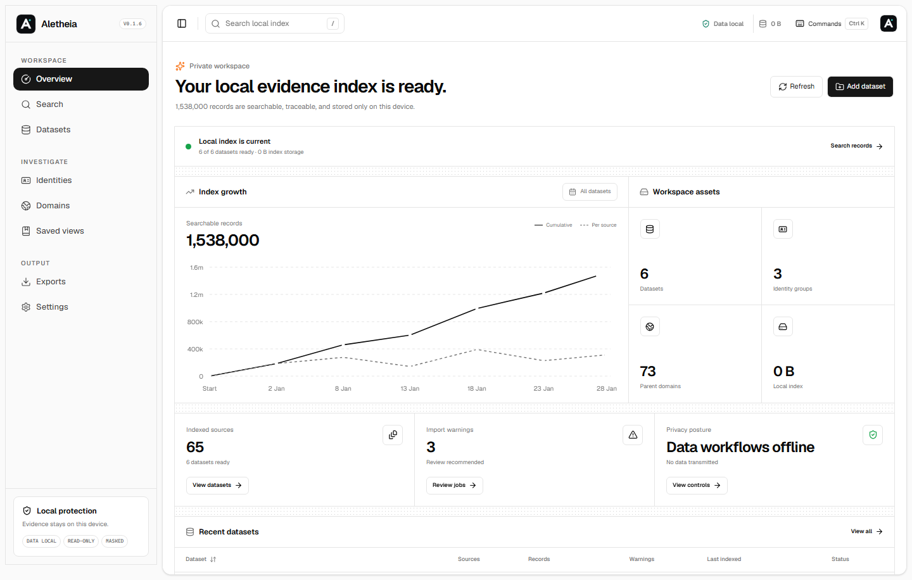
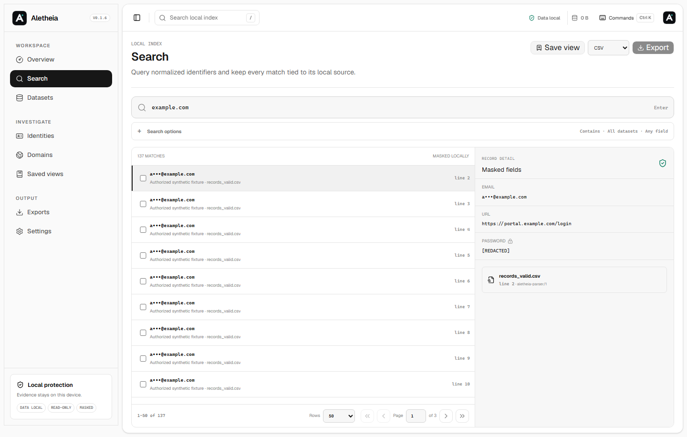
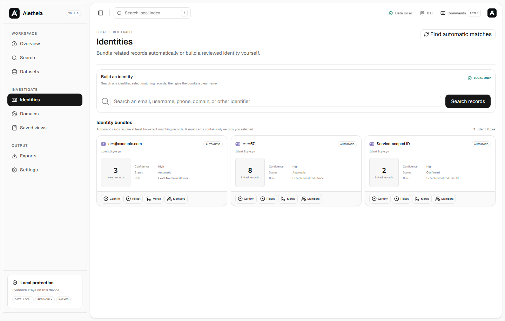
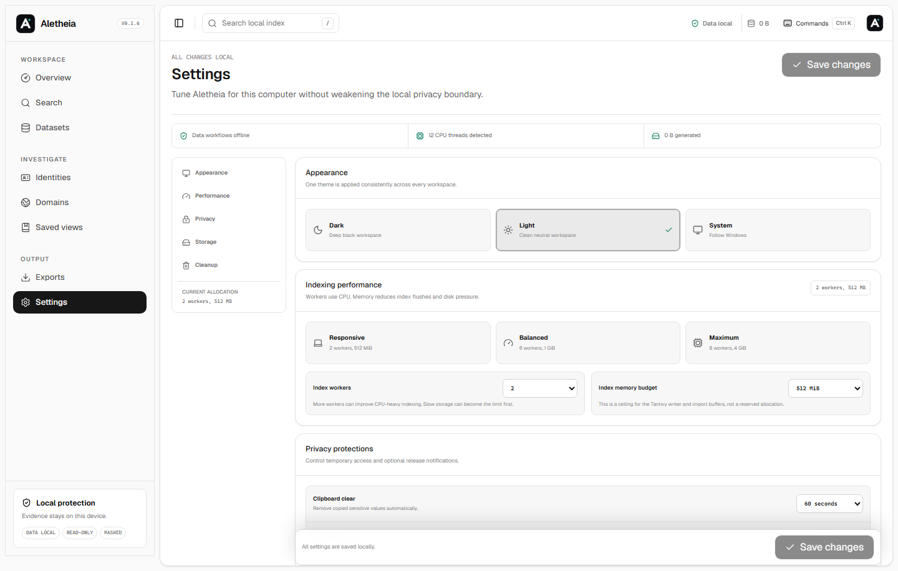

# Aletheia

Aletheia is a local-only Windows desktop application for indexing and investigating datasets you are authorized to possess and analyze. It combines a Tauri 2 desktop shell, React and TypeScript interface, Rust import pipeline, SQLite metadata store, and Tantivy search index.

The application can:

- inspect local TXT, CSV, TSV, JSONL, NDJSON, and GZIP sources through read-only handles;
- stream records into a bounded local indexing pipeline;
- resume cancelled or interrupted imports from persisted local checkpoints;
- search normalized fields with exact, contains, prefix, and structured queries;
- preserve dataset, source file, line, parser, and record traceability;
- group domains with Public Suffix List semantics;
- group identities only through deterministic email, phone, or service-scoped ID rules;
- export selected records as redacted CSV, JSON, JSONL, or Markdown with a manifest;
- clear generated indexes, metadata, caches, temporary files, and history without deleting source files.

The import path uses fixed memory ceilings and 64-bit counters for
multi-terabyte sources. Completion speed still depends on record shape, local
SSD throughput, and having enough workspace capacity for SQLite and Tantivy.

It does not download datasets, test credentials, automate logins, scrape websites, enrich records through remote services, transmit telemetry, or contact people.

## Install on Windows

Open [GitHub Releases](https://github.com/xtofuub/Aletheia/releases) and download:

```text
aletheia_<version>_x64-setup.exe
```

This x64 NSIS setup executable is the recommended download for Windows 10 and 11. It installs Aletheia for the current user, adds a Start Menu shortcut and Windows uninstaller, and handles the required Microsoft Edge WebView2 Runtime. Ordinary users do not need Rust, Cargo, Node.js, npm, or other development tools.

The release also includes `aletheia_<version>_x64.exe` as a standalone testing binary. It is not the recommended normal installation because it does not create shortcuts or an uninstaller. See [Windows distribution](docs/windows-distribution.md) for checksums, alternate MSI deployment, build requirements, and release instructions.

## Privacy model

Data workflows have no network client. React never opens datasets directly: Rust owns the read-only handles, detection, parsing, normalization, SQLite writes, Tantivy writes, masking, and exports. Source datasets are referenced but never copied into the repository or deleted by cleanup.

An optional update check contacts only the official GitHub Releases API with the app version in the user agent. It never includes dataset content, paths, names, queries, indexes, or exports and can be disabled in Settings.

Secret fields are excluded from the general index. Their original values are replaced before storage. Sensitive result fields are masked by default. Search history and export audit data remain inside the selected local workspace.

See [SECURITY.md](SECURITY.md), [PRIVACY.md](PRIVACY.md), and [ARCHITECTURE.md](ARCHITECTURE.md).

## Interface

The dashboard uses the clean, compact structure of the referenced shadcn dashboard as a starting point, adapted to Aletheia's evidence, privacy, and traceability workflows.









All screenshots and examples use invented fixtures with reserved example domains and documentation IP ranges.

## Supported inputs

| Format     | Extensions          | Notes                                            |
| ---------- | ------------------- | ------------------------------------------------ |
| Text       | `.txt`, `.log`      | One bounded record per line                      |
| CSV        | `.csv`              | Conservative delimiter and header detection      |
| TSV        | `.tsv`              | Tab-delimited                                    |
| Delimited  | detected            | Comma, tab, semicolon, or consistent pipe        |
| JSON Lines | `.jsonl`, `.ndjson` | One JSON object per bounded line                 |
| GZIP       | `.gz`               | GZIP-wrapped supported content with ratio limits |

Detection reads at most 256 KiB. Imports enforce a 1 MiB line limit, a 256 KiB field limit, 256 fields per record, and a decompression ceiling.

## Development setup

Requirements:

- Windows 10 or 11
- Node.js 24 or newer
- Rust stable with the `x86_64-pc-windows-msvc` target
- Visual Studio 2022 Build Tools with Desktop development with C++
- WebView2 Runtime

Install and start the web UI:

```powershell
npm install
npm run dev
```

Start the desktop application from a Visual Studio developer shell:

```powershell
npm run tauri dev
```

Build:

```powershell
npm run build
npm run dist:windows
```

The consistently named Windows deliverables are written under `release/`, while native intermediate output remains under `src-tauri/target/release`. Generated build output is ignored by Git.

## Tests and quality gates

```powershell
npm run format:check
npm run lint
npm run typecheck
npm run test
npm run test:e2e
npm run build
npm run safety

cd src-tauri
cargo fmt --check
cargo test
cargo clippy --all-targets --all-features -- -D warnings
cargo bench --bench core_benchmarks
```

See [TESTING.md](TESTING.md) for fixture and benchmark details.

## Storage and cleanup

The selected workspace contains:

```text
metadata.sqlite3
search-index/
cache/
temp/
export-audit/
```

Settings can clear only the known generated paths below that verified root. “Clear all generated state” removes investigation metadata and indexes but leaves external source files and previously exported files untouched.

## Legal and ethical use

Use Aletheia only with data you are legally authorized to possess and analyze. Comply with applicable law, contracts, retention rules, and organizational policy. Aletheia is a defensive investigation tool; it must not be used for credential testing, automated login attempts, harassment, unauthorized access, or redistribution of sensitive data.

## Documentation

- [Development](DEVELOPMENT.md)
- [Testing](TESTING.md)
- [Data formats](DATA_FORMATS.md)
- [Import pipeline](docs/import-pipeline.md)
- [Search syntax](docs/search-syntax.md)
- [Identity grouping](docs/identity-grouping.md)
- [Domain grouping](docs/domain-grouping.md)
- [UI guidelines](docs/ui-guidelines.md)
- [Windows distribution](docs/windows-distribution.md)
