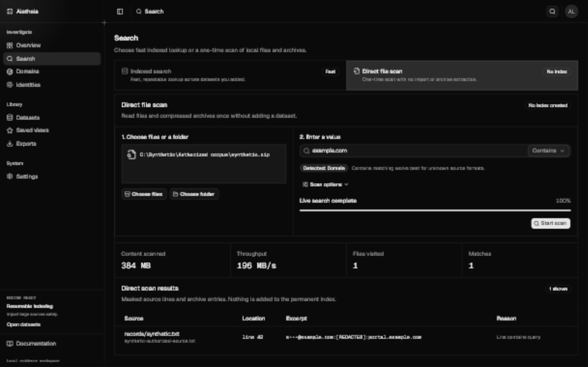
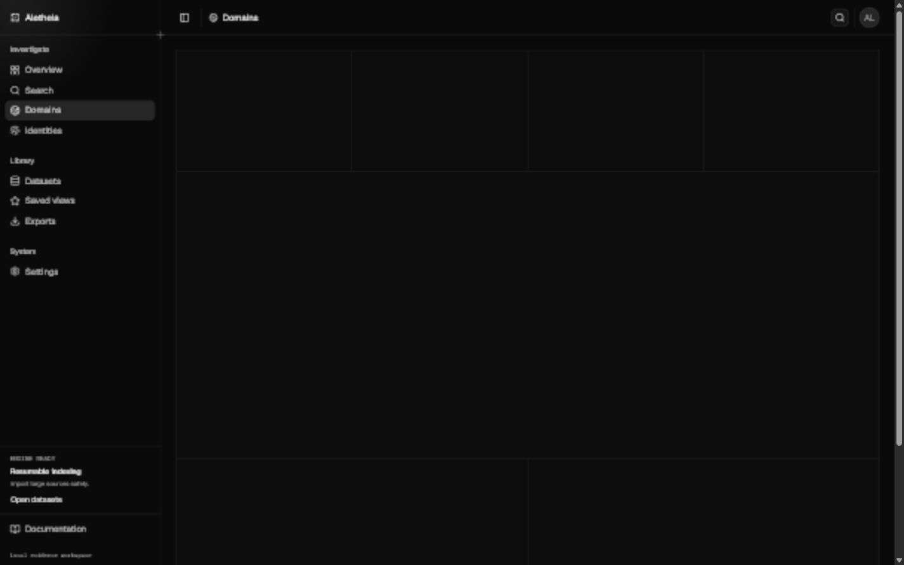
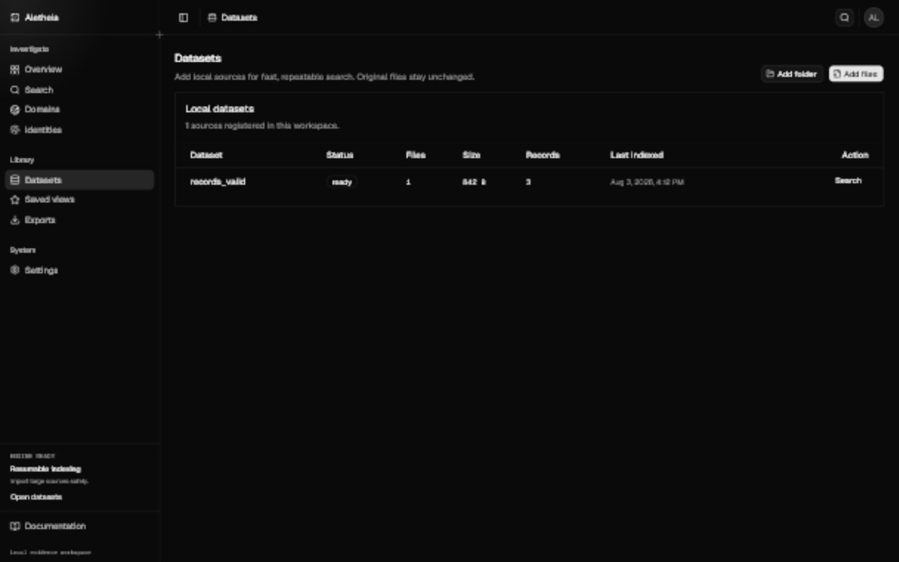
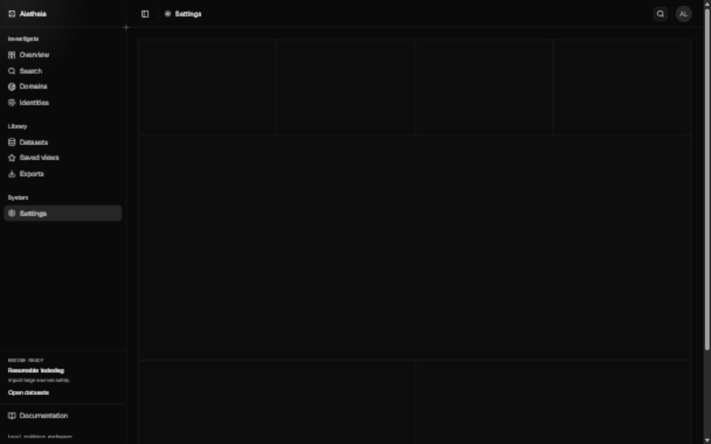

<p align="center">
  
</p>

<h1 align="center">Aletheia</h1>

<p align="center">
  A fast, private Windows workspace for investigating large authorized datasets.<br />
  Local indexing, live archive search, linked evidence, and reviewable identities—without uploading the source.
</p>

<p align="center">
  <a href="https://github.com/xtofuub/Aletheia/releases"></a>
  
  
  
</p>


## What Aletheia does

| Fast local investigation                                                             | Evidence relationships                                                                 | Controlled output                                                                    |
| ------------------------------------------------------------------------------------ | -------------------------------------------------------------------------------------- | ------------------------------------------------------------------------------------ |
| Stream TXT, CSV, TSV, JSONL, NDJSON, GZIP, ZIP, and RAR sources with bounded memory. | Group parent domains, subdomains, exact emails, phone numbers, and service-scoped IDs. | Export reviewed findings to CSV, JSON, JSONL, or Markdown with a sidecar manifest.   |
| Search an index repeatedly or scan archives directly without extraction.             | Keep dataset, source file, line, parser, and record provenance attached.               | Clear generated indexes, metadata, cache, and history without deleting source files. |

Aletheia never tests credentials, automates logins, scrapes websites, enriches records through remote services, sends telemetry, or contacts people.

## Product tour

<table>
  <tr>
    <td width="50%">
      
      <br /><strong>Indexed search</strong><br />Exact, contains, prefix, and structured searches with pagination and source traceability.
    </td>
    <td width="50%">
      
      <br /><strong>Live file search</strong><br />Scan huge local text and archive sources without building a persistent index first.
    </td>
  </tr>
  <tr>
    <td width="50%">
      
      <br /><strong>Domain evidence</strong><br />Filter parent domains and subdomains, then inspect every linked source line.
    </td>
    <td width="50%">
      
      <br /><strong>Identity bundles</strong><br />Review deterministic automatic groups or build a named bundle from selected evidence.
    </td>
  </tr>
  <tr>
    <td width="50%">
      
      <br /><strong>Resumable datasets</strong><br />Pause, cancel, resume, and monitor throughput for long-running imports.
    </td>
    <td width="50%">
      
      <br /><strong>Resource controls</strong><br />Tune worker and memory limits, inactivity locking, updates, storage, and cleanup from one page.
    </td>
  </tr>
</table>

All product images use invented fixtures with reserved example domains and documentation IP ranges. No private records are stored in this repository.

## Install on Windows

Go to [GitHub Releases](https://github.com/xtofuub/Aletheia/releases) and download:

```text
aletheia_<version>_x64-setup.exe
```

The NSIS x64 setup is the recommended package for Windows 10 and 11. It installs for the current user, creates a Start Menu entry, provides a Windows uninstaller, and handles the Microsoft Edge WebView2 Runtime. Rust, Cargo, Node.js, npm, and developer tools are not required.

The release also includes `aletheia_<version>_x64.exe`, a standalone binary intended for testing. See [Windows distribution](docs/windows-distribution.md) for checksums, MSI deployment, and release details.

## Choose the right search path

| Workflow          | Best for                                                              | Tradeoff                                                              |
| ----------------- | --------------------------------------------------------------------- | --------------------------------------------------------------------- |
| **Live files**    | One-off searches across very large TXT, GZIP, ZIP, or RAR collections | No up-front index; repeated searches must read the source again       |
| **Fast index**    | Repeated searches and general investigation                           | Uses local workspace storage while greatly accelerating later queries |
| **Deep analysis** | Domain and identity relationship work                                 | Adds grouping work and storage beyond the fast profile                |

The import pipeline uses streaming readers, fixed memory ceilings, resumable checkpoints, and 64-bit counters. It is designed for multi-terabyte inputs, but real throughput still depends on record shape, compression, workspace capacity, and disk speed. On HDD-based corpora, live sequential scans are usually preferable to random access; placing the Aletheia workspace on an SSD improves indexing and search latency.

## Privacy and safety

- Source files are opened read-only and remain outside the workspace.
- React never reads datasets directly; Rust owns detection, parsing, normalization, SQLite, Tantivy, masking, and exports.
- Secret fields are excluded from the general Tantivy index and replaced before storage.
- Signed update checks contact only the official GitHub release endpoint and can be disabled.
- Cleanup is restricted to known generated paths under the verified Aletheia workspace.

Read [Security](SECURITY.md), [Privacy](PRIVACY.md), and [Architecture](ARCHITECTURE.md) before production use.

## Supported inputs

| Format         | Extensions                                        |        Indexed         | Live files |
| -------------- | ------------------------------------------------- | :--------------------: | :--------: |
| Text and logs  | `.txt`, `.log`                                    |          Yes           |    Yes     |
| Delimited text | `.csv`, `.tsv`, detected comma/tab/semicolon/pipe |          Yes           |    Yes     |
| JSON Lines     | `.jsonl`, `.ndjson`                               |          Yes           |    Yes     |
| GZIP           | `.gz`                                             |          Yes           |    Yes     |
| ZIP and RAR    | `.zip`, `.rar`                                    | No extraction required |    Yes     |

Detection reads at most 256 KiB. Imports enforce a 1 MiB line limit, 256 KiB field limit, 256 fields per record, decompression ceilings, and bounded queues.

## Build from source

Requirements: Windows 10 or 11, Node.js 24+, Rust stable with `x86_64-pc-windows-msvc`, Visual Studio 2022 Build Tools with Desktop development with C++, pnpm, and WebView2.

```powershell
pnpm install
pnpm dev
pnpm tauri dev
```

Create release packages:

```powershell
pnpm build
pnpm dist:windows
```

Run the quality gates:

```powershell
pnpm format:check
pnpm lint
pnpm typecheck
pnpm test
pnpm test:e2e
pnpm safety

cd src-tauri
cargo fmt --check
cargo test
cargo clippy --all-targets --all-features -- -D warnings
```

Generated Windows deliverables are written to `release/`; native intermediate output remains under `src-tauri/target/release`.

## Documentation

- [Development](DEVELOPMENT.md)
- [Testing](TESTING.md)
- [Data formats](DATA_FORMATS.md)
- [Import pipeline](docs/import-pipeline.md)
- [Search syntax](docs/search-syntax.md)
- [Identity grouping](docs/identity-grouping.md)
- [Domain grouping](docs/domain-grouping.md)
- [UI guidelines](docs/ui-guidelines.md)
- [Windows distribution](docs/windows-distribution.md)

## Responsible use

Use Aletheia only with data you are legally authorized to possess and analyze. Follow applicable law, contracts, retention rules, and organizational policy. Aletheia is a defensive investigation tool and must not be used for credential testing, automated login attempts, harassment, unauthorized access, or redistribution of sensitive data.
