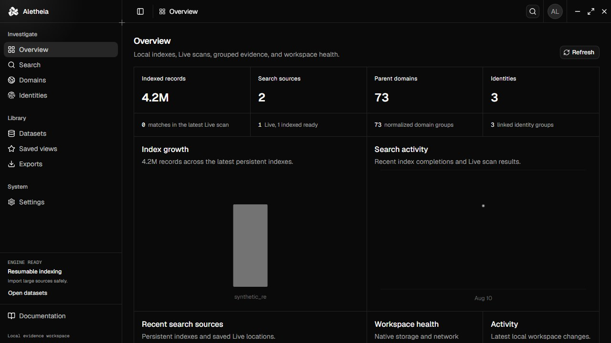
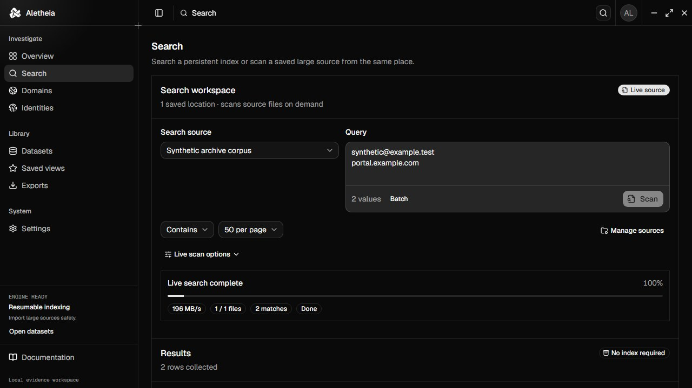
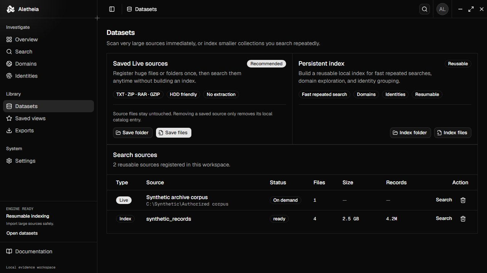

<p align="center">
  
</p>

<h1 align="center">Aletheia</h1>

<p align="center">
  Private, local evidence search for Windows.<br />
  Scan huge files and archives, build reusable indexes, and trace related records without uploading source data.
</p>

<p align="center">
  <a href="https://github.com/xtofuub/Aletheia/releases"></a>
  
  
  
</p>



## Built for large local collections

Aletheia has two search paths so a multi-million-row file does not always need a permanent index.

- **Live scan** streams TXT, CSV, TSV, JSONL, NDJSON, GZIP, ZIP, and RAR sources with bounded memory. Archives are read directly without extraction. Paste up to 512 values to find them in one physical pass instead of rereading a huge collection for every query.
- **Persistent index** stores a reusable Tantivy index for fast repeated searches, pagination, domain grouping, and identity workflows. Imports are cancellable, resumable, and report throughput.
- **Flexible name lookup** finds first and last names across separate fields and common email separators, so `Jane Doe` can match values such as `jane.doe@example.com`.

<table>
  <tr>
    <td width="50%">
      
      <br /><strong>Search before indexing</strong><br />Choose files or a folder, enter a value, and stream the source immediately.
    </td>
    <td width="50%">
      
      <br /><strong>Keep only useful indexes</strong><br />Monitor reusable datasets or remove generated metadata and index data without touching source files.
    </td>
  </tr>
</table>

All screenshots use synthetic fixtures with reserved example domains and documentation IP ranges. No private records are stored in this repository.

## Investigation features

- Exact, contains, prefix, field-specific, and flexible name search with pagination.
- Direct sequential batch search inside text files, GZIP streams, ZIP entries, and RAR entries, with pause, resume, ETA, decoded throughput, and physical-source progress.
- Parent-domain and subdomain navigation with linked source evidence.
- Automatic deterministic identity groups plus manually reviewed bundles from indexed records or selected live-scan evidence.
- Dataset, file, archive-entry, parser, line, and record provenance.
- Redacted CSV, JSON, JSONL, and Markdown exports with sidecar manifests.
- Configurable workers, memory ceilings, inactivity locking, update checks, and generated-data cleanup.
- Signed in-app update checks against official GitHub releases.

Aletheia does not test credentials, automate logins, contact people, scrape websites, send telemetry, or enrich records through remote services.

## Install on Windows

Download the latest recommended installer from [GitHub Releases](https://github.com/xtofuub/Aletheia/releases):

```text
aletheia_<version>_x64-setup.exe
```

The NSIS x64 setup installs for the current user, creates a Start Menu entry, provides an uninstaller, and handles the Microsoft Edge WebView2 Runtime. Ordinary users do not need Rust, Cargo, Node.js, npm, or other development tools.

The release also includes `aletheia_<version>_x64.exe`, a standalone binary for testing. The setup executable is the normal-user package. See [Windows distribution](docs/windows-distribution.md) for checksums, MSI deployment, and release details.

## Performance guidance

| Use case                                      | Recommended path                                                 |
| --------------------------------------------- | ---------------------------------------------------------------- |
| Up to 512 lookups across huge files/archives  | One batch Live scan                                              |
| Hundreds of gigabytes on a physical HDD       | Live scan with 1 worker; keep generated workspace data on an SSD |
| Frequent searches across a curated collection | Persistent **Fast index**                                        |
| Domain and automatic identity grouping        | Persistent **Relationship index**                                |

The import pipeline uses streaming readers, fixed memory ceilings, resumable checkpoints, bounded queues, and 64-bit counters. Live scanning normally wins for a one-off lookup because it avoids writing a much larger reusable structure. Index only the sources you will search repeatedly or need for Domains and automatic Identities. Real throughput depends on disk speed, compression, line length, parser complexity, and workspace capacity. Terabyte-scale operation still requires enough local storage and should be validated against the target hardware before production use.

## Privacy and safety

- Source files are opened read-only and remain in their original locations.
- Removing a dataset deletes generated metadata and index documents only; it never deletes the source.
- Rust owns format detection, parsing, normalization, SQLite, Tantivy, and exports.
- Secret fields are excluded from the general index, and export safety defaults are enforced natively.
- Update checks contact only the official GitHub release endpoint and can be disabled.
- Cleanup is restricted to verified generated paths inside the Aletheia workspace.

Read [Security](SECURITY.md), [Privacy](PRIVACY.md), and [Architecture](ARCHITECTURE.md) before production use.

## Supported inputs

| Format         | Extensions                                        |    Persistent index    | Live scan |
| -------------- | ------------------------------------------------- | :--------------------: | :-------: |
| Text and logs  | `.txt`, `.log`                                    |          Yes           |    Yes    |
| Delimited text | `.csv`, `.tsv`, detected comma/tab/semicolon/pipe |          Yes           |    Yes    |
| JSON Lines     | `.jsonl`, `.ndjson`                               |          Yes           |    Yes    |
| GZIP           | `.gz`                                             |          Yes           |    Yes    |
| ZIP and RAR    | `.zip`, `.rar`                                    | No extraction required |    Yes    |

Detection reads at most 256 KiB. Imports enforce line, field, record, decompression, and queue limits to keep malformed sources bounded.

## Build from source

Requirements: Windows 10 or 11, Node.js 24+, Rust stable with `x86_64-pc-windows-msvc`, Visual Studio 2022 Build Tools with Desktop development with C++, pnpm, and WebView2.

```powershell
pnpm install
pnpm tauri dev
```

Build and verify:

```powershell
pnpm format:check
pnpm lint
pnpm typecheck
pnpm test
pnpm safety
pnpm dist:windows

cd src-tauri
cargo fmt --check
cargo test
cargo clippy --all-targets --all-features -- -D warnings
```

Windows deliverables are written to `release/`; native intermediate output stays under `src-tauri/target/release`.

## Documentation

- [Development](DEVELOPMENT.md)
- [Testing](TESTING.md)
- [Data formats](DATA_FORMATS.md)
- [Import pipeline](docs/import-pipeline.md)
- [Search syntax](docs/search-syntax.md)
- [Identity grouping](docs/identity-grouping.md)
- [Domain grouping](docs/domain-grouping.md)
- [UI guidelines](docs/ui-guidelines.md)
- [Windows distribution](docs/windows-distribution.md)

## Responsible use

Use Aletheia only with data you are legally authorized to possess and analyze. Follow applicable law, contracts, retention rules, and organizational policy. Aletheia is a defensive investigation tool and must not be used for credential testing, automated login attempts, harassment, unauthorized access, or redistribution of sensitive data.
